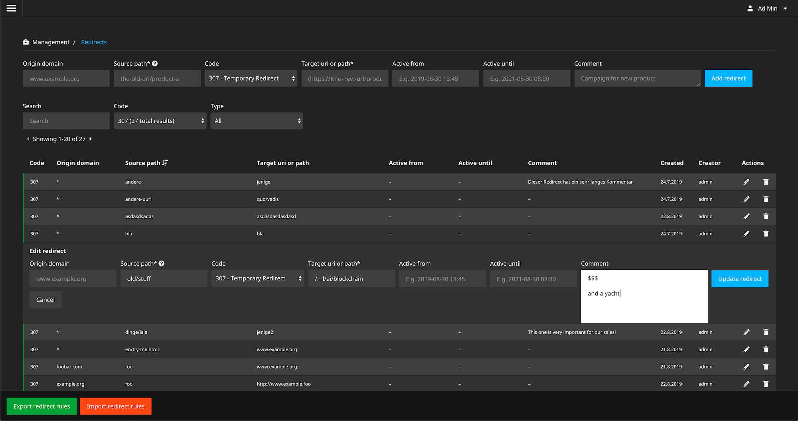
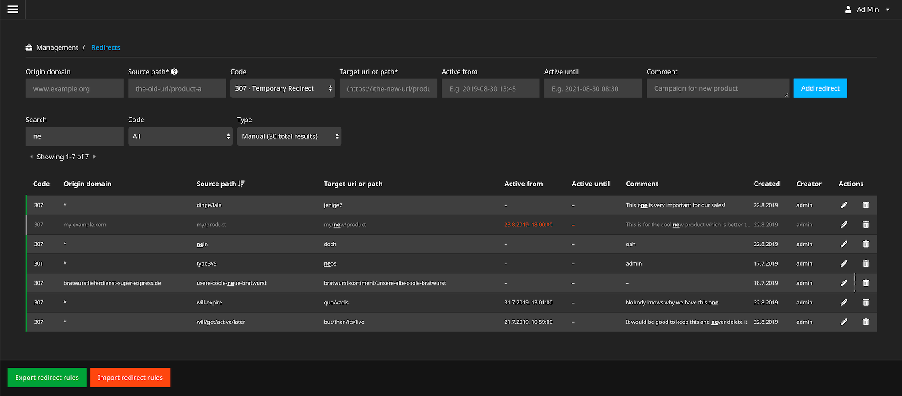

# Neos.RedirectHandler.Ui

This package provides a backend module to manage [Neos.RedirectHandler](https://github.com/neos/redirecthandler) redirects which are stored in [Neos.RedirectHandler.DatabaseStorage](https://github.com/neos/redirecthandler-databasestorage).

## Compatibility and Maintenance

This package is compatible with Neos 3.x, 4.x, 5.x and will be maintained for upcoming versions.

## Installation

1. Run the following command in your site package:

    `composer require neos/redirecthandler-ui --no-update`
    
2. If you don't have dependencies for the other redirect packages yet you should also run the following command:

    `composer require neos/redirecthandler-neosadapter neos/redirecthandler-databasestorage --no-update`
    
3. Run `composer update` in your projects root folder.

4. Then you can add the `RedirectAdministrator` role to the users who need access to the new backend module.

## Screenshots

Listing and editing redirects:

Search & filter redirects:

## Documentation

This package belongs to a group of packages which provides redirect functionality to the Flow Framework and to Neos.
Therefore you can find the documentation regarding Neos [here](https://neos-redirecthandler-adapter.readthedocs.io/en/latest/). 

## Contributing

Please create issues on [Github](https://github.com/neos/redirecthandler-ui) if you encounter bugs or other issues.

### Working on the code

The basis of the backend module is built with Fusion and the UI for managing the redirects
is built with *React* and *Typescript*.

#### Recompiling the js and css parts

1. Use *nvm* so you have the correct *npm* version.
2. Run `yarn` in the package folder.
3. Run `yarn watch` during development or `yarn build` for a new release.
             
## License

See the [License](LICENSE.txt).
